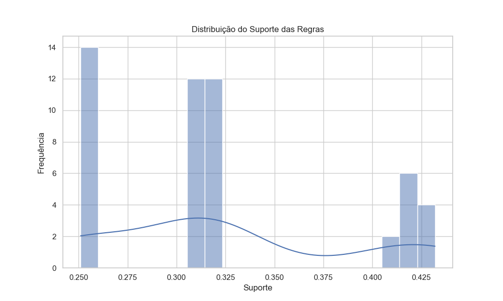
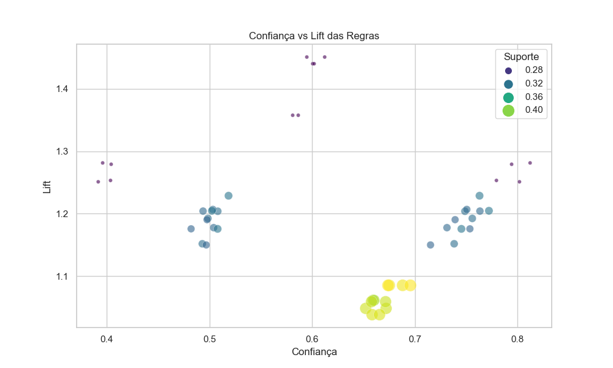
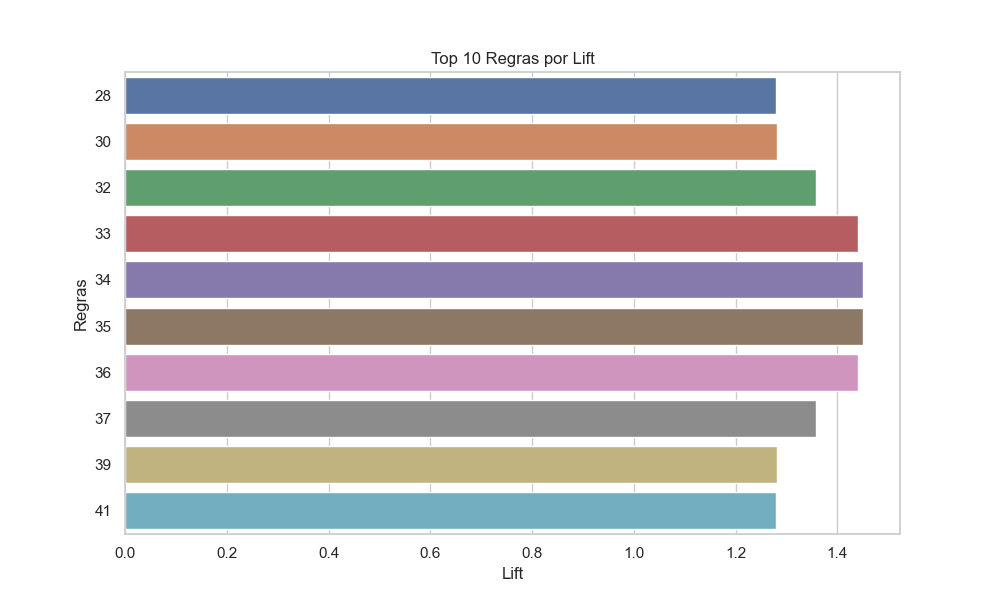

Sistema de Recomendação de Cursos

Descrição
Este projeto implementa um sistema de recomendação de cursos utilizando o algoritmo FP-Growth para analisar associações entre diferentes categorias de cursos oferecidos pela plataforma Udemy.

Estrutura do Projeto
- `data/`: Contém o dataset usado no projeto (ou links para download).
- `notebooks/`: Contém os notebooks Jupyter usados na análise.
- `scripts/`: Contém os scripts Python usados para processamento e análise.
- `README.md`: Este arquivo, descrevendo o projeto.

Pré-requisitos
- Python 3.6 ou superior
- Bibliotecas: pandas, numpy, mlxtend, matplotlib, seaborn

Instalação
Clone o repositório e instale as dependências:
'''sh
git clone https://github.com/natodegelo/Curso_Recomendacao.git
cd Curso_Recomendacao
pip install -r requirements.txt

Resultados

Distribuição do Suporte das Regras

Este gráfico mostra a frequência das associações de categorias de cursos no dataset. O eixo horizontal (Suporte) representa a proporção de transações que incluem a associação, enquanto o eixo vertical (Frequência) representa a quantidade de associações com aquele suporte.
A maioria das regras tem um suporte relativamente baixo, indicando que elas são específicas para subgrupos de cursos.

Relação entre Confiança e Lift das Regras

Este gráfico de dispersão mostra a relação entre a confiança e o lift das regras de associação. A confiança (eixo horizontal) indica a probabilidade de a categoria de curso consequente ser escolhida quando a antecedente é escolhida.
O lift (eixo vertical) indica a força da associação. Cada ponto representa uma regra, com a cor e o tamanho indicando o suporte. Regras com alta confiança e alto lift são mais interessantes, pois indicam associação significativas e não aleatórias.

Regras de Associação mais Fortes (Top 10 por Lift)

As regras com os maiores valores de lift destacam as associações mais fortes entre categorias de cursos. Por exemplo, a combinação de "Graphic Design" com "Musical Instruments" e "Web Development" sugere que esses cursos são frequentemente escolhidos juntos.

1. **Graphic Design -> Musical Instruments**: Estudantes que se inscrevem em "Graphic Design" têm uma probabilidade maior do que a esperada de também se inscreverem em "Musical Instruments".
2. **Musical Instruments -> Graphic Design**: Estudantes que se inscrevem em "Musical Instruments" têm uma probabilidade maior do que a esperada de também se inscreverem em "Graphic Design".
3. **Graphic Design -> Web Development**: Estudantes que se inscrevem em "Graphic Design" têm uma probabilidade maior do que a esperada de também se inscreverem em "Web Development".
4. **Web Development -> Graphic Design**: Estudantes que se inscrevem em "Web Development" têm uma probabilidade maior do que a esperada de também se inscreverem em "Graphic Design".
5. **Business Finance -> Web Development**: Estudantes inscritos em "Business Finance" têm uma probabilidade maior do que a esperada de também se inscreverem em "Web Development". Isso pode indicar um interesse em aplicar habilidades financeiras em negócios digitais.
6. **Web Development -> Business Finance**: Estudantes inscritos em "Web Development" têm uma probabilidade maior do que a esperada de também se inscreverem em "Business Finance". Isso sugere um interesse em entender a parte financeira dos negócios digitais.
7. **Graphic Design, Musical Instruments -> Web Development**: Estudantes inscritos em "Graphic Design" e "Musical Instruments" têm uma probabilidade maior do que a esperada de também se inscreverem em "Web Development". Isso indica uma tendência de buscar uma combinação diversificada de habilidades.
8. **Web Development, Musical Instruments -> Graphic Design**: Estudantes inscritos em "Web Development" e "Musical Instruments" têm uma probabilidade maior do que a esperada de também se inscreverem em "Graphic Design". Isso confirma a complementaridade entre habilidades de design, desenvolvimento e música.
9. **Business Finance, Web Development -> Graphic Design**: Estudantes inscritos em "Business Finance" e "Web Development" têm uma probabilidade maior do que a esperada de também se inscreverem em "Graphic Design". Isso sugere um interesse em uma educação multidisciplinar.
10. **Graphic Design, Business Finance -> Web Development**: Estudantes inscritos em "Graphic Design" e "Business Finance" têm uma probabilidade maior do que a esperada de também se inscreverem em "Web Development". Isso indica uma tendência de buscar habilidades diversificadas para complementar o conhecimento em negócios e design.

Contribuições
Contribuições são bem-vindas! Por favor, abra um issue ou envie um pull request.

Licença
Este projeto está licenciado sob a Licença MIT.
