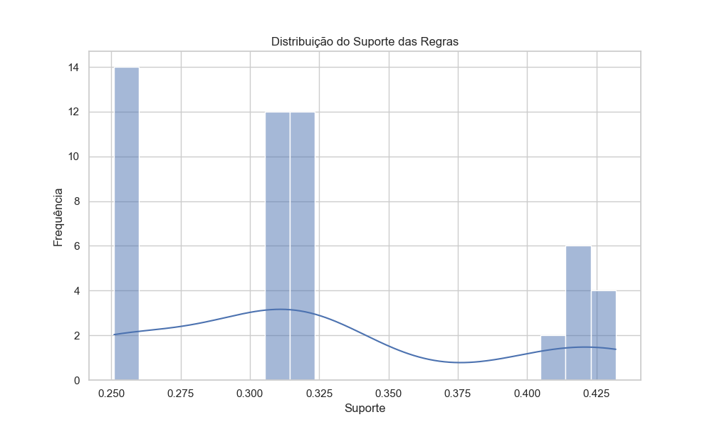
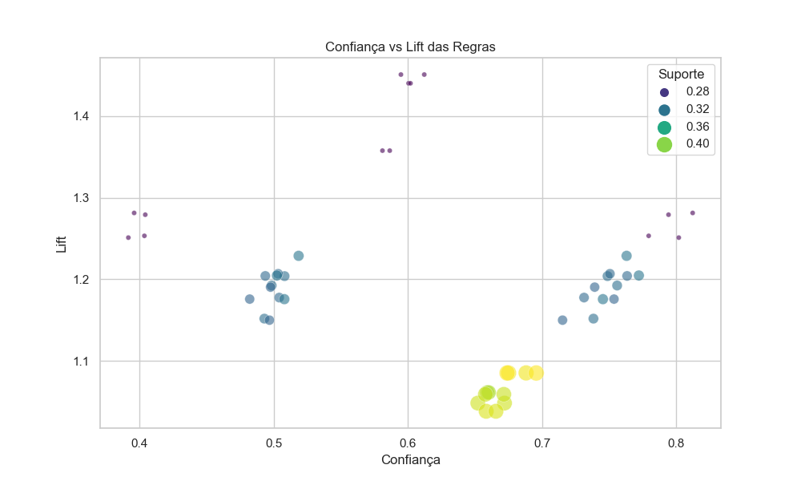
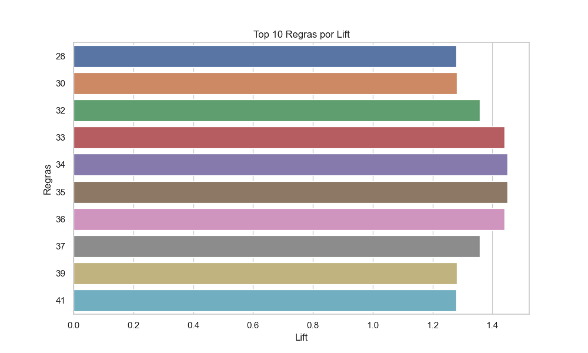

Sistema de Recomendação de Cursos

Descrição
Este projeto implementa um sistema de recomendação de cursos utilizando o algoritmo FP-Growth para analisar associações entre diferentes categorias de cursos oferecidos pela plataforma Udemy.

Estrutura do Projeto
- Data: Contém o dataset usado no projeto (https://www.kaggle.com/datasets/andrewmvd/udemy-courses).
- Notebooks: Contém os notebooks Jupyter usados na análise.
- Scripts: Contém os scripts Python usados para processamento e análise.
- README.md: Este arquivo, descrevendo o projeto.

Pré-requisitos
- Python 3.6 ou superior.
- Bibliotecas: pandas, numpy, mlxtend, matplotlib e seaborn.

Instalação
Clone o repositório e instale as dependências:

```sh
git clone https://github.com/natodegelo/Curso_Recomendacao.git
cd Curso_Recomendacao
pip install -r requirements.txt

_Resultados_

_Distribuição do Suporte das Regras_

Este gráfico mostra a frequência das associações de categorias de cursos no dataset. O eixo horizontal (Suporte) representa a proporção de transações que incluem a associação, enquanto o eixo vertical (Frequência) representa a quantidade de associações com aquele suporte. A maioria das regras tem um suporte relativamente baixo, indicando que elas são específicas para subgrupos de cursos.

_Relação entre Confiança e Lift das Regras_

Este gráfico de dispersão mostra a relação entre a confiança e o lift das regras de associação. A confiança (eixo horizontal) indica a probabilidade de a categoria de curso consequente ser escolhida quando a antecedente é escolhida. Por exemplo:

_Regras de Associação mais Fortes (Top 10 por Lift)_

Este gráfico de barras destaca as 10 regras de associação mais fortes, medidas pelo lift. O lift maior que 1 indica uma associação positiva. Por exemplo, a combinação de "Graphic Design" com "Musical Instruments" e "Web Development" sugere que esses cursos são frequentemente escolhidos juntos, indicando uma tendência dos alunos de buscar complementaridade entre habilidades artísticas e técnicas.

_Top 10 Regras por Lift:_
1. _Graphic Design -> Musical Instruments_: Estudantes que se inscrevem em "Graphic Design" têm uma probabilidade maior do que a esperada de também se inscreverem em "Musical Instruments".
2. _Musical Instruments -> Graphic Design_: Estudantes que se inscrevem em "Musical Instruments" têm uma probabilidade maior do que a esperada de também se inscreverem em "Graphic Design".
3. _Graphic Design -> Web Development_: Estudantes que se inscrevem  "Graphic Design" têm uma probabilidade maior do que a esperada de também se inscreverem em "Web Development".
4. _Web Development -> Graphic Design_: Estudantes que se inscrevem em "Web Development" têm uma probabilidade maior do que a esperada de também se inscreverem em "Graphic Design".
5. _Business Finance -> Web Development_: Estudantes inscritos em "Business Finance" têm uma probabilidade maior do que a esperada de também se inscreverem em "Web Development". Isso pode indicar um interesse em aplicar habilidades financeiras em negócios digitais.
6. _Web Development -> Business Finance_: Estudantes inscritos em "Web Development" têm uma probabilidade maior do que a esperada de também se inscreverem em "Business Finance". Isso sugere um interesse em entender a parte financeira dos negócios digitais.
7. _Graphic Design, Musical Instruments -> Web Development_: Estudantes inscritos em "Graphic Design" e "Musical Instruments" têm uma probabilidade maior do que a esperada de também se inscreverem em "Web Development". Isso indica uma tendência de buscar uma combinação diversificada de habilidades.
8. _Web Development, Musical Instruments -> Graphic Design_: Estudantes inscritos em "Web Development" e "Musical Instruments" têm uma probabilidade maior do que a esperada de também se inscreverem em "Graphic Design". Isso confirma a complementaridade entre habilidades de design, desenvolvimento e música.
9. _Business Finance, Web Development -> Graphic Design_: Estudantes inscritos em "Business Finance" e "Web Development" têm uma probabilidade maior do que a esperada de também se inscreverem em "Graphic Design". Isso sugere um interesse em uma educação multidisciplinar.
10. _Graphic Design, Business Finance -> Web Development_: Estudantes inscritos em "Graphic Design" e "Business Finance" têm uma probabilidade maior do que a esperada de também se inscreverem em "Web Development". Isso indica uma tendência de buscar habilidades diversificadas para complementar o conhecimento em negócios e design.

Contribuições são bem-vindas! Por favor, abra um issue ou envie um pull request.

Este projeto está licenciado sob a Licença MIT.

